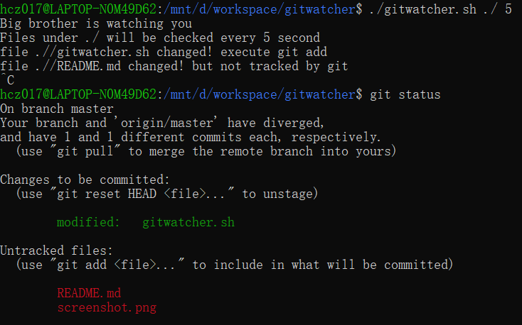

# 目的

在文件修改该后自动执行`git add`，以防止不小心执行`git checkout .` 回退了代码修改。

# 使用方法

在工作的git 仓库下执行：

./gitwatcher.sh 目录 检查间隔时间

示例
```shell
./gitwatcher.sh ./subdir 60
```

截图



注意：目录下的文件不要太多，然后间隔的时间也不要太短，不然`git add` 有可能执行失败。

---

# Purpose

auto execute `git add $file` after file changed, in case of code changes reverted by executing `git checkout .`

# usage

exe below commond under git repo:

./gitwatcher.sh dir second

eg.
```shell
./gitwatcher.sh ./subdir 60
```

screenshot

